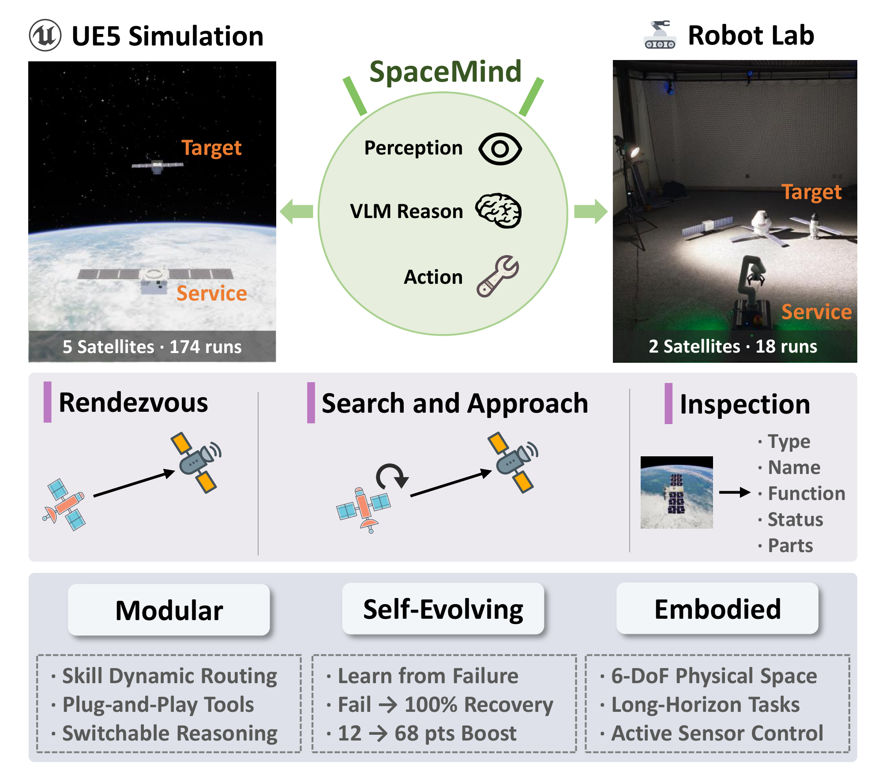
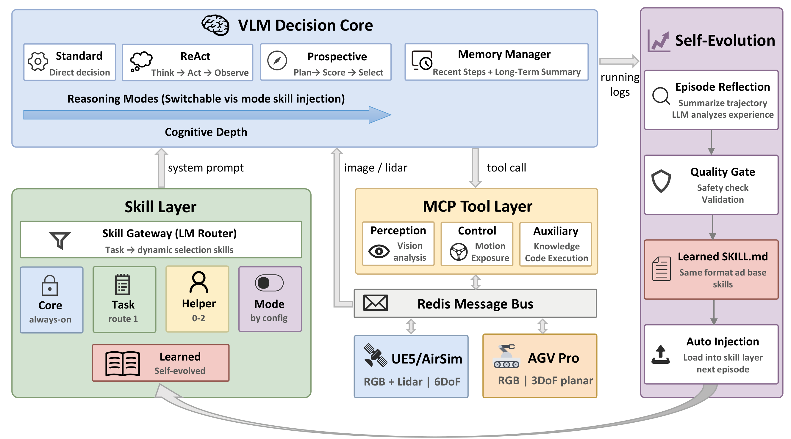

# SpaceMind

**A Modular and Self-Evolving Embodied Vision-Language Agent Framework for Autonomous On-orbit Servicing**

<p align="center">
  <a href="https://arxiv.org/abs/2604.14399"></a>
  &nbsp;<a href="https://arxiv.org/abs/2604.14399"><b>Paper</b></a>
  &nbsp;&nbsp;|&nbsp;&nbsp;
  <a href="https://wuaodi.github.io/SpaceMind/"></a>
  &nbsp;<a href="https://wuaodi.github.io/SpaceMind/"><b>Webpage</b></a>
  &nbsp;&nbsp;|&nbsp;&nbsp;
  <a href="https://youtu.be/X8vZvZIe82U"><b>Video</b></a>
  &nbsp;&nbsp;|&nbsp;&nbsp;
  <a href="SpaceMind_Conference/"><b>Conference Version</b></a>
</p>

<p align="center">
  
</p>

## Overview

SpaceMind is a modular and self-evolving vision-language model (VLM) agent framework for autonomous on-orbit servicing. It uses a VLM as a decision-control hub that perceives the environment through visual sensors, reasons about the current situation, and issues motion and sensor-control commands.

The framework decomposes knowledge, tools, and reasoning into three independently extensible dimensions:

- **Skill Modules with Dynamic Routing** — Task, helper, and mode skills managed by an LLM-based skill gateway
- **MCP Tools with Configurable Profiles** — All tools exposed through the Model Context Protocol; tool sets can be swapped per experiment
- **Injectable Reasoning Modes** — Standard (direct decision), ReAct (thought-action-observation loop), and Prospective (multi-candidate prediction and selection)

An MCP-Redis interface layer enables the **same codebase** to operate across UE5 simulation and physical hardware without modification. A **Skill Self-Evolution** mechanism distills operational experience into persistent skill files without model fine-tuning.

<p align="center">
  
</p>

## Key Results

- **363 closed-loop runs** across 5 satellites, 4 task types, and 2 environments
- **90–100% navigation success** under nominal conditions
- **171 stress-test runs** covering rotating targets, delta-v budgets, actuation/perception degradations, and a fly-around task, scored with continuous metrics (delta-v proxy, path efficiency, pointing latency) and a failure taxonomy
- **Self-evolution recovery**: 4 of 6 groups recover from failure after a single failed episode
- **Zero-code-modification transfer** from simulation to physical robot with 100% rendezvous success

## Repository Structure

```
SpaceMind/
├── SpaceMind_Lab/          # Journal paper: physical robot (AGV Pro + Orbbec Gemini 2)
│   ├── host.py             # Main agent loop
│   ├── run_lab_phase_a.py  # Standard experiment runner
│   ├── run_lab_phase_b_tta.py  # Self-evolution experiment runner
│   ├── config/             # CLI config, framework manifest, evaluation protocol
│   ├── models/             # VLM client (OpenAI-compatible API)
│   ├── reasoning/          # Skill gateway, memory, TTA manager, world model reasoner
│   ├── skills/             # Skill modules (SKILL.md files)
│   ├── tools/              # MCP server and Redis-based tool implementations
│   └── test_agv_pro/       # Robot hardware test scripts
│
├── SpaceMind_UE5/          # Journal paper: UE5 simulation (AirSim)
│   ├── host.py             # Main agent loop
│   ├── run_phase_*.py      # Experiment runners (phases A–E)
│   ├── config/             # CLI config, framework manifest, evaluation protocol
│   ├── models/             # VLM client
│   ├── reasoning/          # Skill gateway, memory, TTA manager, world model reasoner
│   ├── skills/             # Skill modules
│   ├── tools/              # MCP server and Redis-based tool implementations
│   ├── environments/
│   │   ├── satellite_pipeline/  # UE5/AirSim interface (requires your own UE5 project)
│   │   └── threejs_env/         # Lightweight Three.js environment (runs out of the box)
│   ├── runtime_logs/       # Result parser (continuous metrics + failure taxonomy)
│   └── results/            # Per-run results of the challenge campaign (JSONL)
│
└── SpaceMind_Conference/   # Conference version (SPAICE 2025, accepted)
```

## Installation

```bash
# Clone the repository
git clone https://github.com/wuaodi/SpaceMind.git
cd SpaceMind

# Install dependencies
pip install -r SpaceMind_Lab/requirements.txt   # for Lab
pip install -r SpaceMind_UE5/requirements.txt   # for UE5

# Set up environment variables
cp .env.example .env
# Fill in your API keys in .env
```

## Usage

See [TESTING.md](TESTING.md) for a step-by-step guide covering setup, environment launch, link verification, agent runs, stress injection, and result parsing.

### Quick Start without UE5 (Three.js Environment)

The UE5 assets are not distributed with this repository. To let anyone run the full agent stack out of the box, `SpaceMind_UE5/environments/threejs_env/` provides a lightweight browser-based environment that speaks the exact same Redis interface as the UE5/AirSim pipeline: RGB images, part-level segmentation, LiDAR point clouds, pose truth, exposure control, and the stress-injection switches (target spin, actuation noise, thruster fault, LiDAR dropout, exposure disturbance). `host.py`, tools, and skills run unmodified against it.

The five target satellites (BioSentinel, CAPSTONE, Huygens, IBEX, New Horizons) are rendered from [NASA 3D Resources](https://science.nasa.gov/3d-resources/) models (public domain), scaled to the same physical dimensions used in the paper experiments.

Requires Node.js, Python, and a local Redis server.

```bash
# 1. Start the environment (installs npm deps, builds the page, opens the browser)
cd SpaceMind_UE5/environments/threejs_env
python launch_env.py

# Optional environment switches
python launch_env.py --satellite IBEX                    # pick a target satellite
python launch_env.py --spin_deg_s 0.5                    # rotating target (E1)
python launch_env.py --noise                             # actuation noise (E3N)
python launch_env.py --fault_axis dy --fault_scale 0.5   # thruster fault (E3F)
python launch_env.py --lidar_dropout 0.3                 # LiDAR dropout (E4L)

# 2. Verify the Redis link
python self_test.py --scenario smoke

# 3. Run the agent as usual
cd ../..
python host.py --task rendezvous-hold-front --tool_profile oracle_full
```

Note that this environment uses simplified rendering and geometry sampling; it is intended for running and extending the framework, not for reproducing the exact numbers reported in the paper, which were obtained in UE5.

### UE5 Simulation

Requires a running UE5 environment with AirSim plugin and Redis server. Build your own UE5 project with the AirSim plugin and import the NASA satellite models under `/Game/Meshes/Spacecraft_136/<SatelliteName>/`; the scripts in `environments/satellite_pipeline/` handle satellite placement and scene control.

```bash
# Phase A: Standard reasoning mode evaluation
python SpaceMind_UE5/run_phase_a.py --satellite CAPSTONE --task rendezvous --mode standard --condition C1

# Phase B: Batch experiments across conditions
python SpaceMind_UE5/run_phase_b.py

# Phase D: Skill self-evolution experiments
python SpaceMind_UE5/run_phase_d.py --satellite CAPSTONE --task inspection --condition C2
```

### Physical Laboratory

Requires AGV Pro robot with ROS2, Orbbec Gemini 2 camera, and Redis server.

```bash
# Phase A: Standard experiments
python SpaceMind_Lab/run_lab_phase_a.py --task search_approach --mode standard

# Phase B: Skill self-evolution experiments
python SpaceMind_Lab/run_lab_phase_b_tta.py --task search_approach --mode standard
```

## Conference Version

The conference version of this work has been accepted at the **IAA Conference on AI in and for Space (SPAICE 2025)**. The corresponding code is preserved in the [`SpaceMind_Conference/`](SpaceMind_Conference/) folder.

## Citation

If you find this project useful, please consider citing:

Journal preprint: [arXiv:2604.14399](https://arxiv.org/abs/2604.14399)

```bibtex
@article{wu2026spacemind,
  title={SpaceMind: A Modular and Self-Evolving Embodied Vision-Language Agent Framework for Autonomous On-orbit Servicing},
  author={Wu, Aodi and Han, Haodong and Luo, Xubo and Wang, Ruisuo and He, Shan and Wan, Xue},
  journal={Acta Astronautica},
  year={2026},
  note={Under review},
  eprint={2604.14399},
  archivePrefix={arXiv}
}
```

Conference version:

```bibtex
@inproceedings{wu2025spacemind,
  title={SpaceMind: An Embodied VLM-Based Agent for Autonomous Spacecraft Proximity Operations},
  author={Wu, Aodi and Luo, Xubo and Wan, Xue},
  booktitle={IAA Conference on AI in and for Space (SPAICE 2025)},
  year={2025}
}
```

## Acknowledgements

This work is supported by the Technology and Engineering Center for Space Utilization, Chinese Academy of Sciences, and the University of Chinese Academy of Sciences.
